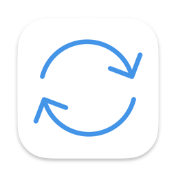

# AutoMove



Python script running in background for macOS, to automatically move [Notability](https://apps.apple.com/us/app/notability/id360593530) backups from either a OneDrive directory or a NAS to an iCloud directory, in realtime.

**Functionalities** :

- Automatically **sends notifications to Notification Center in macO**S when anything happens (copy of a file, multiple files, copy failure, app starting)
- **Real-time** updates
- **Automatically structures the backup folder** on either NAS or OneDrive by smartly inferring the structure based on the file names
- **One and only one instance** can run simultaneously on the same machine

## Setting things up

### **1 - Install the dependencies** using the following command:

```bash
pip install -r requirement.txt
```

### **2 - Fill in `config.ini`**

You just have to fill `config.ini` with the corresponding paths : 
- The path to your mounted iCloud folder
- *Optionally*: The path to your mounted OneDrive folder
- *Optionally, if not above*: The credentials for SFTP connection to your NAS drive.

The `config.ini` file should have this form:

```ini
[PATHS]
icloud_path = <Path to mounted iCloud folder>
onedrive_path = <Path to mounted OneDrive fodler, if using OneDrive>
sftp_path = <Path for Notability temporary auto-backup on NAS>
sftp_backup_path = <Path for structured backup on NAS>

[SFTP]
sftp_host = <NAS URL or IP address>
sftp_port = <SFTP Port>
sftp_account = <SFTP Account>
sftp_pw = <SFTP Password>
```

## Run it in the background or in an [Automator](https://support.apple.com/fr-fr/guide/automator/welcome/mac) app

To have it run on the background, use the following command from terminal :

```bash
python3 main.py [-h] [--sftp] [-v] &
```

You can easily set up an Automator app starting AutoMove automatically when logging in by creating a Shell script-executing app, and insert in it the following command :

```shell
nohup /usr/local/bin/python3 <path to Python script>/main.py > /dev/null 2>&1 &
```
Just open the Automator app and set it on your device to start at the beginning of a session, et voilà :)


```bash
sudo wget https://github.com/shiftkey/desktop/releases/download/release-2.9.4-linux1/GitHubDesktop-linux-2.9.4-linux1.deb

sudo apt-get install gdebi-core
sudo gdebi /home/your_username/GitHubDesktop-linux-2.9.4-linux1.deb


```